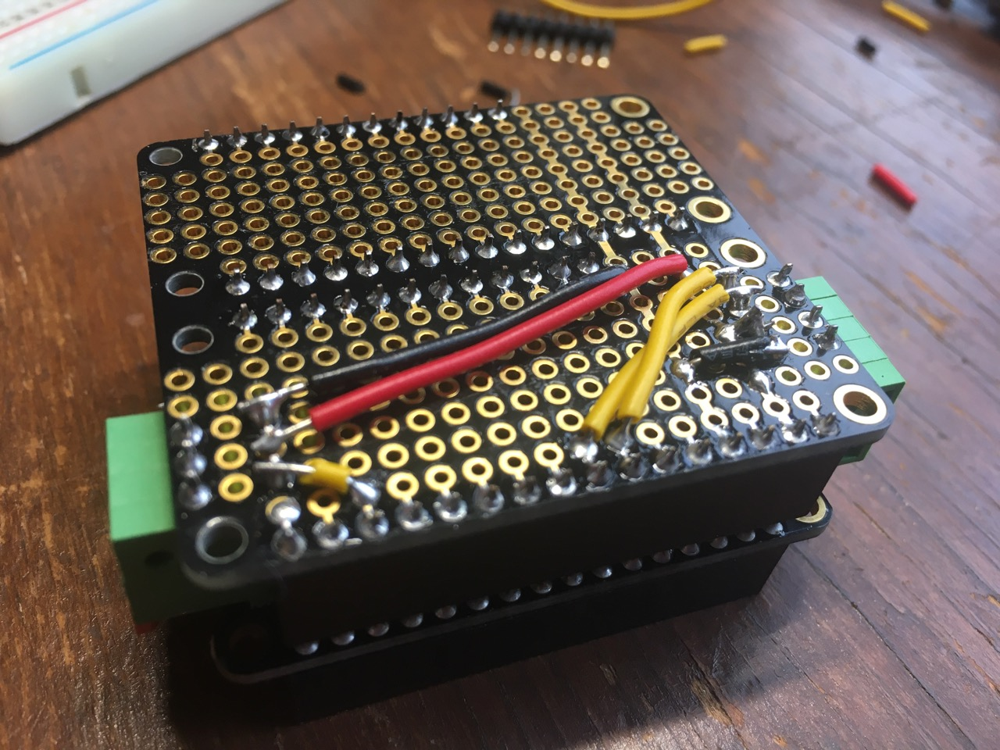

# gage-particle 

Building a river gage using [Particle.io](https://store.particle.io/collections/cellular/products/boron-lte-kit) with to incorperate what I learned during my last attempt at building one.

## Why

It turns out to be very expensive to have the USGS run a river gage (due to Congressionally set managment standards).
This puts setting up a gage on smaller watersheds well past the point of being reasonable for groups of paddlers or environmental organizations to set one up.

My goal with this project is to develop a low cost gage that is simple enough for most groups of paddlers or environmental organizations to be able to set one up.

## Current status

Under development. Specifically in pieces on my desk.

## Learnings from last time

Some of the things that I learned last time.

- Power is hard, reliability of single board computers in the Maine (and generally wherever interesting rivers can be found) elements is even harder.
- Use a third party data system until the device is reliable. No need for dealing with having your own server down while trying to debug the device.
- Paying for a system with integrated networking and power is worth it.
- Don't try to develop the server and the device at the same time from scratch.

## What is all this hardware

Scary

Also:

- Particle.io [Boron (cellular)](https://store.particle.io/collections/cellular/products/boron-lte-kit) or [Argon (wifi)](https://store.particle.io/collections/wifi/products/argon-kit). - \$59.00 or 35.00
  - The particles are cloud connected microcontrollers with built in cellular or wifi. They run a variant of C++ called wiring that was popularized by Arduino.
  - What makes them really nice is the cloud control and update interface that Particle.io runs.
    You can send commands, check variables, and recieve events remotely.
    Events can be forwared via webhooks to other servers.
    You can also remotely flash the hardware!
  - They also deal with cell carriers, so you can have a single plan that works for devices worldwide. \$2.99 a month for 3 MB of data. Doesn't seem like much, but they have done a lot of work to minimize data overhead, so that can actually go a relatively long way.
  - Much lower power than a single board computer like a Raspberry Pi or Beaglebone Black (what I developed the previous generation of gage with). It also includes a lithium battery charger, so the gage will hopefully not need an external charge controller.
  - They also have a built in mesh communication system. I'm not planning on taking advantage of it in the near term, but it opens up some interesting possibilities. Especially with ho putting a gage near enough to a river might put the device in a cellular dead zone, you can relay from the sensing device to one that has a cellular connection...
  - The mesh system can also be used as a Bluetooth Low Energy perpherial. I envision setting it up to log data via BLE UART virtual serial so that anyone can connect their phone and see the current reading.
- [Adafruit FeatherWing Real Time Clock + SD data logger](https://www.adafruit.com/product/2922) - \$8.95
  - Particle's mesh series of boards are built to [Adafruit's Feather standard](https://learn.adafruit.com/adafruit-feather/overview), therefore we can use most boards that follow the standard.
  - This board provides a real time clock with it's own backup battery and a microSD slot.
  - The microSD is used to store device logs, and data.
  - The real time clock is used to keep track of time for the Particle as it doesn't have a backup clock for when it's shutdown or in sleep mode.
  - Requires a [CR1220](https://www.adafruit.com/product/380) coin cell battery (~$.95) and a [microSD card](https://www.adafruit.com/product/1294) (~$9.95).
- [Adafruit Feather Doubler](https://www.adafruit.com/product/2890) - \$7.50
  - Allows the Particle board and Adafruit logger to be mounted side by side. It also gives some prototyping space for wiring up sensors.
  - I'm current using some [Configurable Spring Terminal Blocks](https://www.adafruit.com/product/1074) (\$4.95) to connect the sensors to the board.
- [Maxbotix MB7386 NRXL-MaxSonar-WRLT](https://www.maxbotix.com/Ultrasonic_Sensors/MB7386.htm) ultrasonic distance sensor - \$199.95
  - We have to find out how far away the water is somehow right? This way our sensor doesn't have to be in the water and the gage can be self contained.
  - This sensor works from .5 to 10 meters, and is supposed to be pretty good for water.
  - It's weather sealed (important for the parts of the device that will be outside the box).
  - It communicates over TTL serial, analog, and pulse width modulation. TTL serial means that we can read the exact millimeters the sensor is picking up instead of trying to calculate voltage differences (analog).
  - [Mounting hardware](https://www.maxbotix.com/Ultrasonic_Sensors/MB7950.htm) (\$3.00) for mounting the sensor in a drilled out hole and keeping it water tight.
- Temperature sensor - currently a hacked together Seeed Studio Grove sensor as I had it laying around.
  - Will probably switch to [AM2303 temp-humidity sensor](https://www.adafruit.com/product/393) (\$15.00) or similar.
  - A temperature sensor should not be neccessary for operation, however lithium batteries are not the largest fans of being charged in very cold or very warm temperatures, so it would be useful to manage charging if those temperatures are encountered.
- [3.7V 6600 mAh Lithium Ion Battery](https://www.adafruit.com/product/353) - \$29.50
  - While the Particle Boron and Argon kits include batteries, this one has a good bit more oomph. If we're hoping to record and transmit data overnight, then a larger battery will hopefully leave us with a bit more usable charge in the morning.
- [Voltaic 9 Watt Solar Panel](https://voltaicsystems.com/9-watt-panel/) - \$79.00
  - I have two of these panels left over from my previous experiment which needed a lot of power. I have heard of folks using 1 watt panels with the Particle mesh devices.
  - Also needs a [microUSB adapter](https://voltaicsystems.com/f3511-microusb/) (\$6.00).
- Waterproof storage box
  - I've been using a [sprinkler system box](https://www.amazon.com/gp/product/B000VYGMF2/) (~\$33.48) that is very oversized for the Particle board, but it was sized for 12V battery and charging system for the previous incantation of the gage. Nicely, it does have two predrilled ports, one that is the right size for the ultrasonic sensor.
  - Probably could use some simplier outdoor electrical boxes too.

Currently the parts add up to around \$450 if you already have soldering, cables, and other random (wood) parts laying around.

## Software & Services

The device depends on the [Particle cloud console](http://console.particle.io) (free with device/cell plan) for management and communication.
From there data can be forwared to other services like Ubidots (see the [test device dashboard](https://industrial.ubidots.com/app/dashboards/public/dashboard/8-TRHCH-qfrA_7u0CV7Xc-4hAHc)).

The device itself runs a C++ variant called Wiring that was popularized by Arudinos.

Particle has a few [tutorials](https://docs.particle.io/tutorials/device-os/device-os/), but perhaps most useful is the [device firmware referenece](https://docs.particle.io/reference/device-os/firmware/boron/).

### Device Software

[`gage-particle.ino`](src/gage-particle.ino) is our devices's entrypoint.
I've tried to keep it's file structure as simple as possible so that you can build up an understanding of different parts as you need it.

However there are some key things to know.

#### Structure

I've largely followed the [`Runnable`](src/runnable.h) class structure found in [Arduino the Object Oriented Way](http://paulmurraycbr.github.io/ArduinoTheOOWay.html).
That way the publicly exposed interface for most classes follows the primary `constructor`, `setup()` `loop()` pattern that the main file follows, and internal details on how a sensor works or how often data is sent to the Particle console are taken care of by the internal structure of each class.

##### [`Runnable`](src/runnable.h)

A [`Runnable`](src/runnable.h) class has at least a `void setup()` and a `void loop()`. Almost everything inherits from `Runnable`.

##### [`SettingManager`](src/settings_manager.h)

[`SettingManager`](src/settings_manager.h) takes care of retrieving and persisting settings data to the `EEPROM` when the device is powered off. It also sets up [`Particle.function()`](https://docs.particle.io/reference/device-os/firmware/boron/#particle-function-)s allowing settings to be changed from the Particle Console.

##### [`NetworkManager`](src/network.h)

[`NetworkManager`](src/network.h) takes care of managing cellular or wifi status.

##### [`DataLogger`](src/logging/data_logger.h) and [`DataLog`](src/logging/data_logger_manager.h)

[`DataLogger`](src/logging/data_logger.h) and [`DataLog`](src/logging/data_logger_manager.h) expand upon the design of the system [`LogHandler` and `Log`](https://docs.particle.io/reference/device-os/firmware/boron/#logging).

`DataLogger` subclasses provide mechanisms to log messages or key/value pairs to various systems (Particle console, Serial, Ubidots, microSD, Bluetooth Low Energy UART). A logger may transmit data immediately, or buffer it.

`DataLogger`s expose 4 key methods.

- `void add_value(char *key, float value)` - Add a named data point, like a sensor reading.
- `void log_message(String message)` - Add a message for output.
- `void persist_values()` - If a logger buffers values (say in a `std::map`) save the latest values immediately. Usually called from `DataLogger::loop()` rather than directly.
- `void update_settings(struct Settings settings)` - Allows logger internal settings to be updated if the general settings have been changed.

`DataLog` is a global/singleton manager that distributes data out to registered `DataLoggers`.

`DataLog` should be imported by indivudal sensors or other classes or functions looking to persist data.

`DataLog` extends the functionality of `DataLogger` (which it passes to registered loggers) with `add_logger(DataLogger &logger)` to register the loggers.

#### [`Sensor`](src/sensor/sensor.h)

[`Sensor`](src/sensor/sensor.h)s follow the `Runnable` structure, and extend it with a `float value()` method that immediately returns the key value that it is monitoring.

Mainly however `Sensor`s use `DataLog` within their loops to directly log values as they are read, and individual loggers control what to do with those values.

#### Dependencies

There are a few external dependencies.

- [provideyourown/statistics](https://github.com/provideyourown/statistics/tree/45e5e3d11cd8c80b85f7337c4cc4f5037ef66d51) soon to be replaced with [dndubins/QuickStats](https://github.com/dndubins/QuickStats) for providing sensor data statistical analysis (allowing a mean or median to be taken rather than just the latest value).
- [Seeed-Studio/https://github.com/Seeed-Studio/Grove_Temperature_And_Humidity_Sensor](https://github.com/Seeed-Studio/Grove_Temperature_And_Humidity_Sensor) for the current temperature sensor.
- [rickkas7/PublishQueueAsyncRK](https://github.com/rickkas7/PublishQueueAsyncRK) for pushing in the background, and persisting publish backlogs when there is no connection. _Not implemented yet._
- [rickkas7/JsonParserGeneratorRK](https://github.com/rickkas7/JsonParserGeneratorRK) for forming Ubidots compatible publish JSON.
- [rickkas7/SDCardLogHandlerRK](https://github.com/rickkas7/SdCardLogHandlerRK) for logging data to microSD card and avoiding dealing with [SDFat](https://github.com/greiman/SdFat) directly. _Not implemented yet._

#### [Particle.io Functions](https://docs.particle.io/reference/device-os/firmware/boron/#particle-function-)

Various settings controlling the device can be set via the Particle.io console (or via API).

- `settings-ubidots_update_seconds` - Set the number of seconds between sending updates to Ubidots. Defaults to 30 during testing. Should be increased once deployed. Sending `'stop'` should stop updates all together.
- `wifi_add_network` - You can add a new network to the device remotely (when it's already connected to a network it knows). Call the function with `ssid:password` to add the new SSID. Or use `particle serial wifi`.

### Cloud

The gage depends on the Particle Console to operate, and Ubidots can make displaying data much easier.

#### Particle Console

Particle console allows you to see latest events, current device status, and send functions to the device.

As events can be forwarded as webhooks, IFFFT, Google Cloud Functions, AWS Lambda, and a ton of other options with HTTP APIs are options for recieving data.

#### Ubidots

Ubidots offers a [free STEM offering](https://ubidots.com/stem/) which makes for a nice development dashboard.

## Burning fingers (aka soldering)

- Port 5 of the ultrasonic sensor is connected to Serial1 rx port
- For the Grove sensor, yellow connects to A2, and white to A3.

## Todo

- Switch to using a median rather than a mean for sensor statistics.
- ~~Use Real Time Clock~~
- Log data to microSD card
- Use semi-automatic and ~~threaded~~ system modes
- Manage cellular/wifi connections in `NetworkManager`
- Get it in the field for testing
